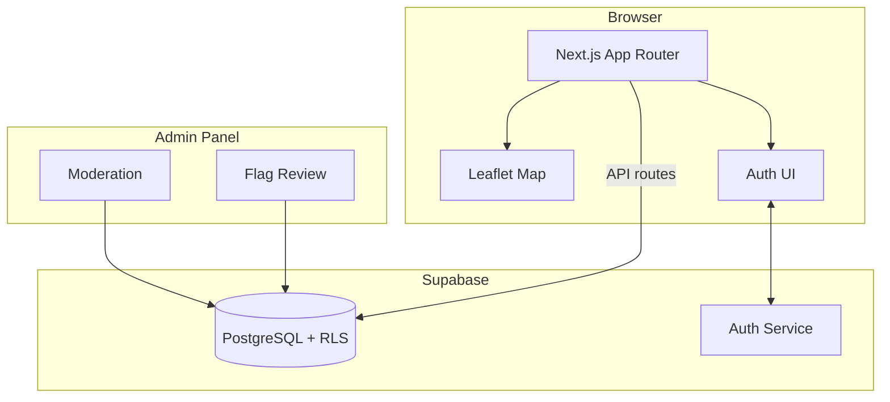
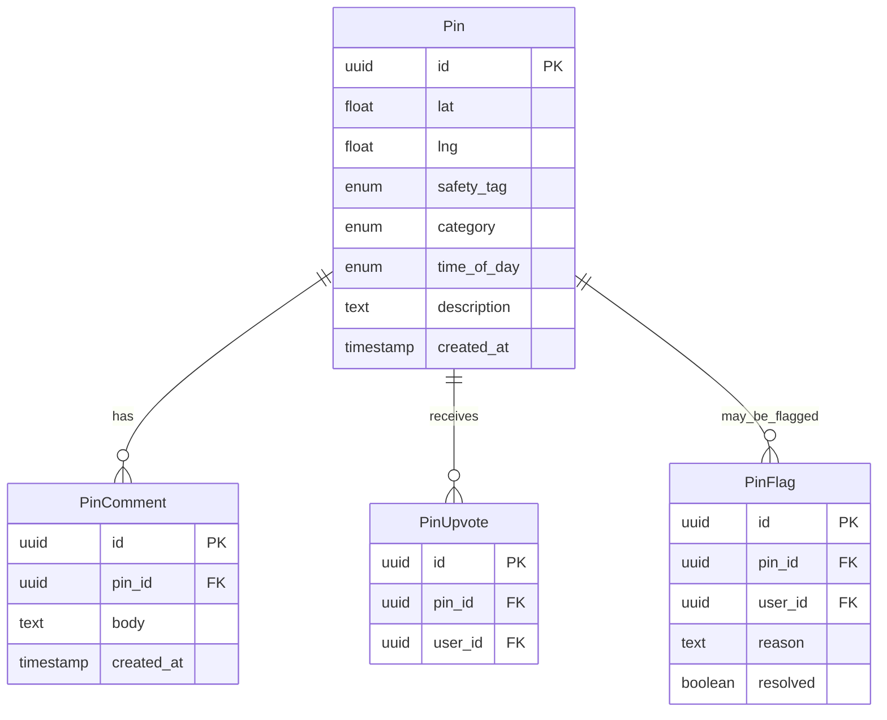

# Architecture

## Overview

SheSafe is a community safety map application. Users place, categorize, and discuss safety-related pins on an interactive map.

## Data Model

## Route Design

| Route | Purpose | Auth Required |
|-------|---------|---------------|
| `/` | Main map view with pins | No (guest read) |
| `/auth` | Sign in / sign up | No |
| `/admin` | Moderation dashboard | Yes |
| `/api/pins` | Pin CRUD | Varies |
| `/api/pins/:id/comments` | Pin comments | No (read) / Yes (write) |
| `/api/pins/:id/upvote` | Upvote a pin | Yes |
| `/api/pins/:id/flag` | Flag a pin | Yes |
| `/api/admin/flags` | List/resolve flags | Admin only |

## Key Design Decisions

1. **Guest read access** — The map is publicly viewable to maximize community usefulness. Writing requires authentication.
2. **Supabase RLS** — Row-level security enforces data isolation at the database level, not just in application code.
3. **No background tracking** — All pins are intentionally placed by users. There is no passive location collection.
4. **Category + tag system** — Pins have both a category (lighting, harassment, etc.) and a safety tag (safe, mixed, unsafe) for flexible filtering.
